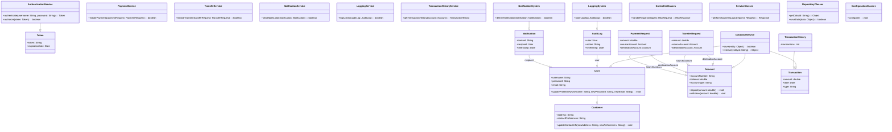

# SpringBoot Micro-Servies

```mermaid
classDiagram
  class User {
    +username: String
    +password: String
    +email: String
    +updateProfile(newUsername: String, newPassword: String, newEmail: String): void
  }

  class Customer {
    +address: String
    +contactPreferences: String
    +updateContactInfo(newAddress: String, newPreferences: String): void
  }

  class AuthenticationService {
    +authenticate(username: String, password: String): Token
    +authorize(token: Token): boolean
  }

  class Token {
    +token: String
    +expirationDate: Date
  }

  class Account {
    +accountNumber: String
    +balance: double
    +accountType: String
    +deposit(amount: double): void
    +withdraw(amount: double): void
  }

  class Transaction {
    +amount: double
    +date: Date
    +type: String
  }

  class PaymentService {
    +initiatePayment(paymentRequest: PaymentRequest): boolean
  }

  class PaymentRequest {
    +amount: double
    +sourceAccount: Account
    +destinationAccount: Account
  }

  class TransferService {
    +initiateTransfer(transferRequest: TransferRequest): boolean
  }

  class TransferRequest {
    +amount: double
    +sourceAccount: Account
    +destinationAccount: Account
  }

  class NotificationService {
    +sendNotification(notification: Notification): boolean
  }

  class Notification {
    +content: String
    +recipient: User
    +timestamp: Date
  }

  class LoggingService {
    +logActivity(auditLog: AuditLog): boolean
  }

  class AuditLog {
    +user: User
    +action: String
    +timestamp: Date
  }

  class TransactionHistoryService {
    +getTransactionHistory(account: Account): TransactionHistory
  }

  class TransactionHistory {
    +transactions: List<Transaction>
  }

  class NotificationSystem {
    +deliverNotification(notification: Notification): boolean
  }

  class LoggingSystem {
    +storeLog(log: AuditLog): boolean
  }

  class DatabaseService {
    +save(entity: Object): boolean
    +retrieve(entityId: String): Object
  }

  class ControllerClasses {
    +handleRequest(request: HttpRequest): HttpResponse
  }

  class ServiceClasses {
    +performBusinessLogic(request: Request): Response
  }

  class RepositoryClasses {
    +getData(id: String): Object
    +saveData(data: Object): boolean
  }

  class ConfigurationClasses {
    +configure(): void
  }

  User --|> Customer
  AuthenticationService --|> Token
  PaymentRequest --|> Account: sourceAccount
  PaymentRequest --|> Account: destinationAccount
  TransferRequest --|> Account: sourceAccount
  TransferRequest --|> Account: destinationAccount
  Notification --|> User: recipient
  AuditLog --|> User: user
  TransactionHistory --|> Transaction
  NotificationSystem --|> Notification
  LoggingSystem --|> AuditLog
  DatabaseService --|> User
  DatabaseService --|> Account
  DatabaseService --|> Transaction

```

